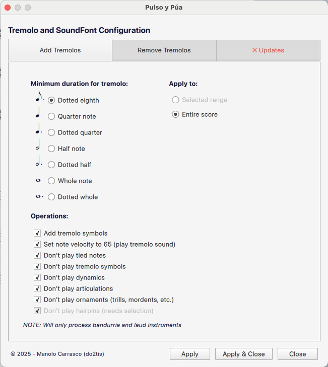
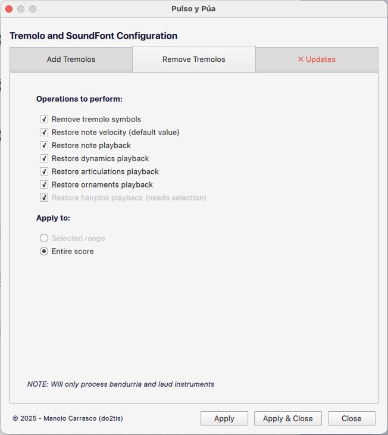
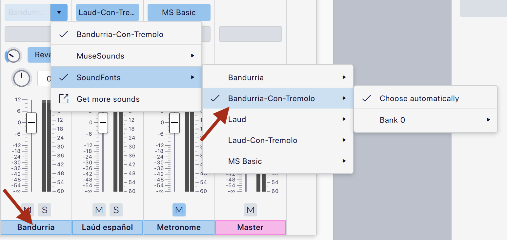
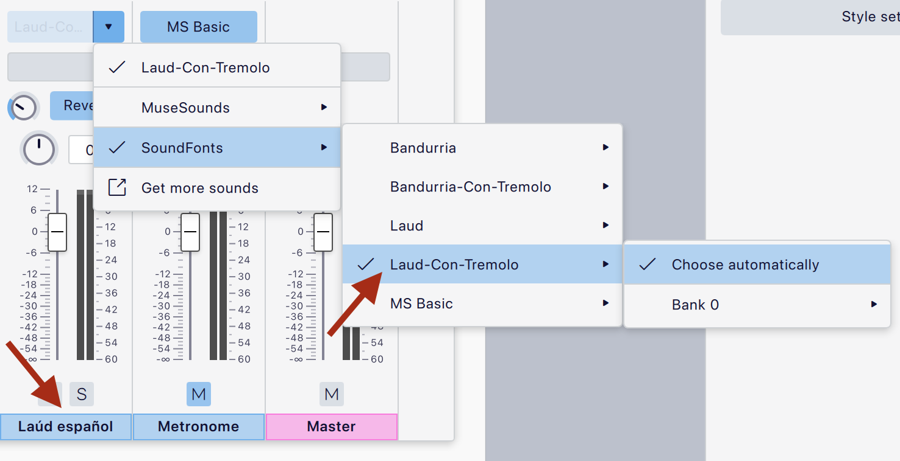
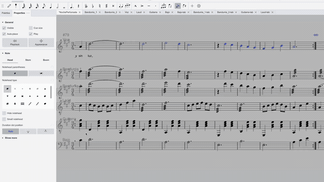
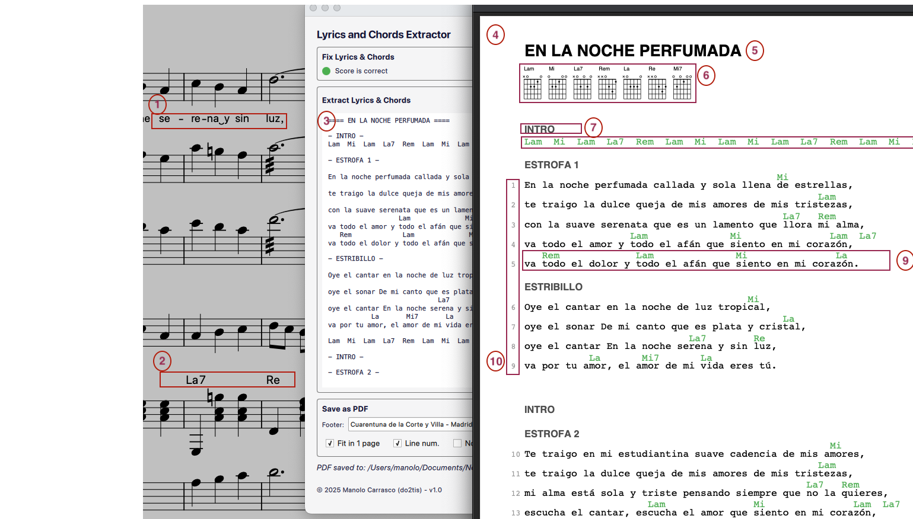
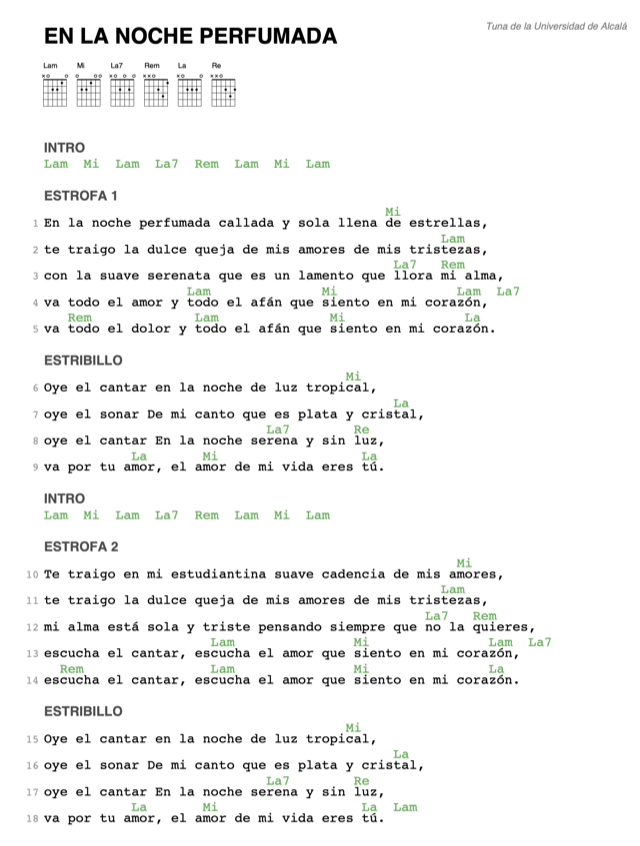

# Pulso y Púa - Fuentes de Sonido y Herramientas de MuseScore
Fuentes de sonido, plugin de automatización de trémolo y extensión de extracción de letras para Orquesta de Pulso y Púa.

🇬🇧 [**Read in English**](README.md)

<video src="https://user-images.githubusercontent.com/161853/230922586-ccc289d1-93b2-4ee4-aa14-f38ddb9e39e5.mov" height="150" controls></video>

☝️ haz clic para escuchar una demo de sonido, también puedes probarlo en mi espacio de [musescore](https://musescore.com/user/46235/scores/10469212/s/uPKnxg)

## Tabla de Contenidos
- [Fuentes de Sonido](#fuentes-de-sonido)
- [Plugin de MuseScore](#plugin-de-musescore)
  - [Por Qué Este Plugin es Necesario](#por-qué-este-plugin-es-necesario)
  - [Características](#características)
  - [Instalación](#instalación)
  - [Uso](#uso)
  - [Atajo de Teclado](#atajo-de-teclado)
  - [Notas Importantes](#notas-importantes)
- [Lyrics Extractor](#lyrics-extractor)
  - [Características](#características-de-lyrics-extractor)
  - [Instalación](#instalación-de-lyrics-extractor)

## Fuentes de Sonido

- [Bandurria.sf2](https://github.com/manolo/sound-fonts/raw/main/Bandurria.sf2) Fuente de sonido para Bandurria, tiene solo un canal con sonidos picados y sin trémolo
- [Bandurria-Con-Tremolo.sf2](https://github.com/manolo/sound-fonts/raw/main/Bandurria-Con-Tremolo.sf2) Fuente de sonido para Bandurria, tiene un canal, para seleccionar sonidos picados usa velocidades 1-64, y para trémolo 65-127
- [Laud.sf2](https://github.com/manolo/sound-fonts/raw/main/Laud.sf2) Fuente de sonido para Laúd, tiene solo un canal con sonidos picados y sin trémolo
- [Laud-Con-Tremolo.sf2](https://github.com/manolo/sound-fonts/raw/main/Laud-Con-Tremolo.sf2) Fuente de sonido para Laúd, tiene un canal, para seleccionar sonidos picados usa velocidades 1-64, y para trémolo 65-127
- [Guitarra-Clasica.sf2](https://github.com/manolo/sound-fonts/raw/main/Guitarra-Clasica.sf2) Fuente de sonido para Guitarra Clásica Española.
- [Laudin.sf2](https://github.com/manolo/sound-fonts/raw/main/Laudin.sf2) Fuente de sonido para Laudín (laúd pequeño), solo sonidos picados.

## Plugin de MuseScore

### Por Qué Este Plugin es Necesario

El plugin **Pulso y Púa** es esencial para usar correctamente estas fuentes de sonido en MuseScore debido a cómo se implementa el trémolo:

#### El Desafío del Trémolo

La bandurria y el laúd son instrumentos de púa únicos donde la técnica característica del trémolo es fundamental para su sonido. Sin embargo:

1. **No Hay Programa MIDI para Trémolo**: A diferencia del trémolo de violín (que usa un programa MIDI diferente), los instrumentos de púa no tienen un programa MIDI dedicado para trémolo.

2. **Trémolo Basado en Velocidad**: Estas fuentes de sonido implementan el trémolo usando la velocidad MIDI:
   - **Velocidad 1-64**: Sonido picado/punteado (nota simple)
   - **Velocidad 65-127**: Sonido de trémolo (repetición rápida)

3. **La Configuración Manual es Tediosa**: Sin automatización, tendrías que:
   - Establecer manualmente la velocidad a 65 para cada nota larga
   - Añadir símbolos de trémolo (cosmético, para la partitura) y desactivar su reproducción para evitar el molesto sonido sintético de trémolo
   - Desactivar la reproducción de dinámicas, articulaciones y reguladores que interfieren con el trémolo
   - Desactivar la reproducción de notas ligadas (solo debe sonar la primera nota)
   - Manejar casos especiales (notas staccato, trinos, notas cortas, etc.)

#### ¿Por Qué Desactivar Elementos de Reproducción?

El plugin desactiva la reproducción de ciertos elementos musicales porque:

- **Dinámicas y Reguladores**: Estos afectan la velocidad, lo cual entra en conflicto con el sistema de trémolo basado en velocidad. Si las dinámicas cambian la velocidad, la fuente de sonido no cambiará correctamente entre sonidos picados y de trémolo.
- **Articulaciones**: Muchas articulaciones modifican la velocidad o duración de las notas, interfiriendo con el umbral de velocidad del trémolo.
- **Notas Ligadas**: Solo la primera nota en una cadena de ligaduras debe sonar; las notas ligadas subsiguientes deben estar en silencio.

**Importante**: Desactivar la reproducción no elimina estos elementos de la partitura—permanecen visibles para los músicos que leen la partitura. Simplemente no afectan la reproducción MIDI.

### Características

El plugin **Pulso y Púa** proporciona tres funciones principales:

#### 1. Añadir Trémolo

Configura automáticamente tu partitura para reproducción de trémolo:

- **Añade símbolos de trémolo** a notas largas (umbral de duración configurable)
- **Establece velocidad de nota a 65** para activar el sonido de trémolo
- **Desactiva reproducción** de notas ligadas (excepto primera en la cadena)
- **Desactiva reproducción de trémolo** (opcional - mantiene el símbolo solo visual)
- **Desactiva reproducción de dinámicas, articulaciones, ornamentos y reguladores**
- **Detección inteligente**:
  - Omite notas cortas (comportamiento staccato)
  - Omite notas con articulaciones staccato
  - Maneja articulaciones que aumentan velocidad de forma inteligente
  - Detecta y omite notas con ornamentos de trino

#### 2. Quitar Trémolo

Revierte toda la configuración de trémolo: elimina símbolos, restaura velocidades y reproducción de notas, dinámicas, articulaciones, ornamentos y reguladores.

#### 3. Gestor de Fuentes de Sonido

Gestor integrado para descargar, actualizar y verificar las fuentes de sonido de Bandurria y Laúd, además de auto-actualización del plugin.

### Instalación

1. **Descarga el plugin**: [PulsoPua.qml](https://github.com/manolo/sound-fonts/raw/main/PulsoPua.qml)

2. **Instala en MuseScore**:
   - Copia `PulsoPua.qml` a tu carpeta de plugins de MuseScore:
     - **Windows**: `%HOMEPATH%\Documents\MuseScore4\Plugins`
     - **macOS**: `~/Documents/MuseScore4/Plugins`
     - **Linux**: `~/Documents/MuseScore4/Plugins`

3. **Habilita el plugin**:
   - Abre MuseScore
   - Ve a `Plugins` → `Gestor de Plugins`
   - Marca la casilla junto a "Pulso y Púa"
   - Haz clic en `OK`

4. **Descarga las fuentes de sonido** (usando el plugin):
   - Ve a `Plugins` → `Pulso y Púa`
   - Cambia a la pestaña "SoundFonts"
   - Haz clic en "Descargar Todas" o descarga individualmente
   - Las fuentes de sonido se instalarán en tu directorio de SoundFonts de MuseScore

### Uso

#### Flujo de Trabajo Básico

1. **Selecciona el rango de tu partitura**:
   - Para MuseScore 4.6 o hasta que se solucione el [issue #31061](https://github.com/musescore/MuseScore/issues/31061), debes **seleccionar toda la partitura** (`Ctrl+A` / `Cmd+A`) antes de ejecutar el plugin
   - El plugin solo procesa instrumentos de bandurria y laúd

2. **Abre el plugin**:
   - Ve a `Plugins` → `Pulso y Púa`

3. **Configura los ajustes de trémolo**:
   - **Duración Mínima**: Elige el umbral de duración (ej. negra, negra con puntillo, blanca)
   - Marca/desmarca operaciones según necesites:
     - Añadir símbolos de trémolo
     - Establecer velocidad de nota
     - Desactivar notas ligadas
     - Desactivar dinámicas, articulaciones, ornamentos, reguladores

4. **Elige el rango de procesamiento**:
   - **Rango seleccionado**: Procesa solo los compases seleccionados
   - **Toda la partitura**: Procesa todas las partes de bandurria/laúd

5. **Haz clic en "Añadir Trémolo y Cerrar"**

6. **Para quitar trémolo**: Usa la pestaña "Quitar Trémolo" con opciones similares

### Atajo de Teclado

Si usas este plugin frecuentemente, es muy recomendable asignar un atajo de teclado:

1. Ve a `Editar` → `Preferencias` → `Atajos`
2. Busca "Pulso y Púa"
3. Haz clic en el plugin y asigna un atajo (ej. `Ctrl+Shift+T` / `Cmd+Shift+T`)
4. Haz clic en `OK`

Ahora puedes alternar rápidamente la configuración de trémolo con tu atajo de teclado.

### Notas Importantes

#### Requisito de Selección en MuseScore 4.6

Debido al [issue #31061 de MuseScore](https://github.com/musescore/MuseScore/issues/31061), el plugin no puede acceder programáticamente a los reguladores (crescendo/diminuendo) a menos que:

1. **Selecciones toda la partitura primero** (`Ctrl+A` / `Cmd+A`)
2. **Luego ejecutes el plugin**

Esta limitación solo afecta a la versión oficial de MuseScore 4.6. Las compilaciones personalizadas con la extensión de API `curScore.spanners` no requieren selección manual.

**¿Qué pasa si no seleccionas?**
- La casilla "Desactivar/Restaurar reproducción de reguladores" estará **deshabilitada** y mostrará "(necesita selección)"
- Todas las demás características del plugin funcionan normalmente
- Solo se omitirá el procesamiento de reguladores

#### Detección de Instrumentos

El plugin detecta automáticamente instrumentos de bandurria y laúd verificando:
- Nombre largo de la parte
- Nombre corto de la parte
- ID del instrumento

Solo se procesarán las partes de bandurria/laúd detectadas.

#### Selección de Fuente de Sonido

Después de añadir la configuración de trémolo:
1. Selecciona los pentagramas de bandurria/laúd
2. Abre el Mezclador (`F10`)
3. Cambia la fuente de sonido a **"Bandurria-Con-Tremolo"** o **"Laud-Con-Tremolo"**
4. Las notas con velocidad ≥65 ahora se reproducirán con sonido de trémolo

#### Personalización

El plugin te permite:
- Elegir qué operaciones realizar
- Establecer umbrales de duración personalizados
- Procesar rangos seleccionados o toda la partitura
- Mantener símbolos de trémolo solo visuales (desactivar reproducción de trémolo)

## Lyrics Extractor

Una extensión de MuseScore 4 que extrae letras con acordes alineados de partituras musicales y genera texto formateado y PDF, ideal para cancioneros, hojas de ensayo y cifrados.

### Características de Lyrics Extractor

- **Letras con acordes alineados**: extrae las letras del pentagrama de melodía y los acordes del acompañamiento, manteniéndolos perfectamente alineados
- **Verificación y corrección automática**: detecta y corrige formato de sinalefas, cadenas silábicas rotas, problemas de sincronización de acordes e hifenes manuales
- **Manejo de repeticiones y estructura**: procesa signos de repetición, voltas, D.S., D.C., Coda, Fine y secciones con múltiples estrofas
- **Marcadores de sección**: reconoce etiquetas de texto de sistema (INTRO, SOLISTA, ESTRIBILLO) y marcas de ensayo como divisores de sección
- **Modo solo acordes**: para partituras instrumentales sin letra, muestra progresiones de acordes estructuradas por secciones y barras de compás
- **Diagramas de trastes**: extrae diagramas de acordes de guitarra de marcos FBox y los renderiza en el encabezado del PDF
- **Generación de PDF**: crea PDFs listos para imprimir en A4 con acordes en color, alineación monoespaciada, ajuste automático a una página (opcional), números de línea y encabezados/pies de página
- **Notación solfeo y anglosajona**: sigue la configuración de cifrado de la partitura (Do-Re-Mi o C-D-E)
- **Herramienta CLI**: el mismo motor de extracción disponible como herramienta de línea de comandos Node.js

### Instalación de Lyrics Extractor

1. **Descargar**: [lyrics-extractor.mext](https://github.com/manolo/sound-fonts/raw/main/lyrics-extractor.mext)
2. **Instalar**: arrastra el archivo `.mext` sobre MuseScore 4 (o haz doble clic). La extensión aparecerá en la barra de herramientas y en el menú de Extensiones.

### Soporte

Para problemas, preguntas o contribuciones:
- **GitHub Issues**: [Reportar un error o solicitar una característica](https://github.com/manolo/sound-fonts/issues)
- **Foro de MuseScore**: [Discutir en MuseScore.org](https://musescore.org/en/user/46235)

**© 2026 - Manolo Carrasco (do2tis)**

