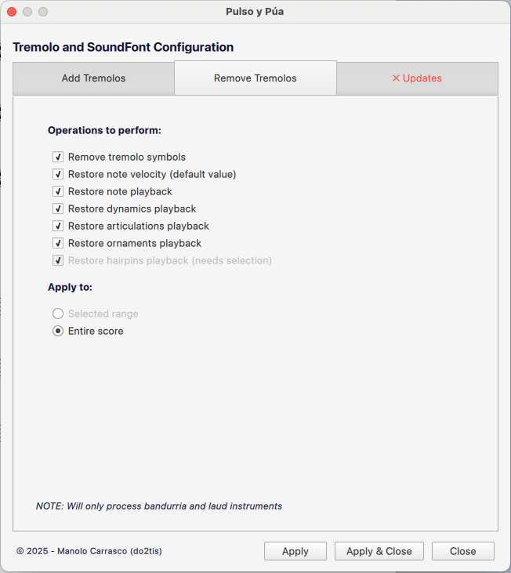
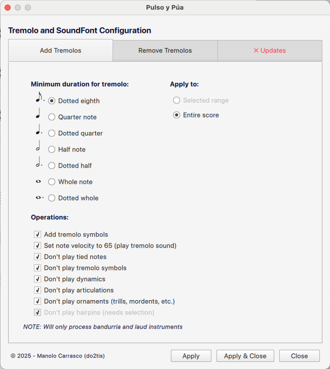
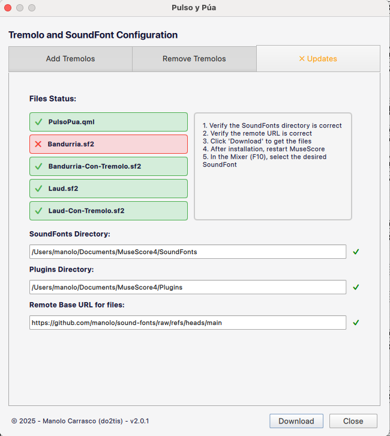
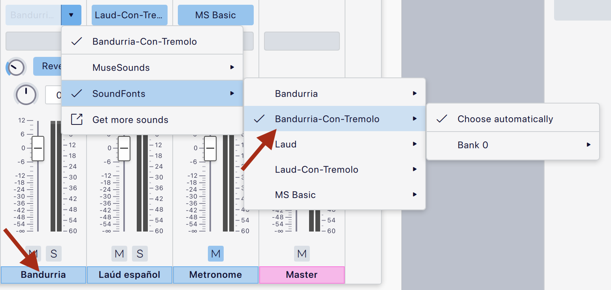
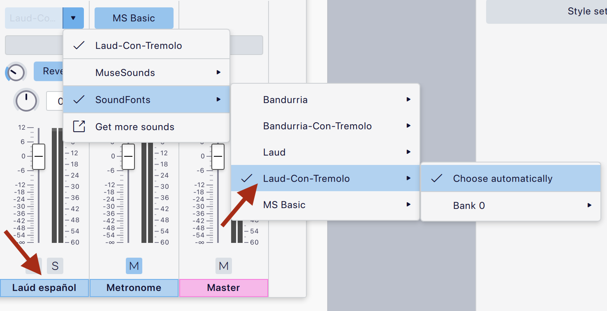

# Pulso y Púa Sound Fonts & MuseScore Plugin
Sound Fonts and automation plugin for Spanish Plectro Orchestra (Orquesta de Pulso y Púa).

🇪🇸 [**Leer en español**](README.es.md)

<video src="https://user-images.githubusercontent.com/161853/230922586-ccc289d1-93b2-4ee4-aa14-f38ddb9e39e5.mov" height="150" controls></video>

☝️ click to listen a demo sound, you can also try it in my [musescore](https://musescore.com/user/46235/scores/10469212/s/uPKnxg) space

## Table of Contents
- [Sound Fonts](#sound-fonts)
- [MuseScore Plugin](#musescore-plugin)
  - [Why This Plugin is Necessary](#why-this-plugin-is-necessary)
  - [Features](#features)
  - [Installation](#installation)
  - [Usage](#usage)
  - [Keyboard Shortcut](#keyboard-shortcut)
  - [Important Notes](#important-notes)

## Sound Fonts

- [Bandurria.sf2](https://github.com/manolo/sound-fonts/raw/main/Bandurria.sf2) Soundfont for Bandurria, it has only one channel with picked sounds and no tremolo
- [Bandurria-Con-Tremolo.sf2](https://github.com/manolo/sound-fonts/raw/main/Bandurria-Con-Tremolo.sf2)  Soundfont for Bandurria, it has one channel, for selecting picked sounds use velocities 1-64, and for tremolo 65-127
- [Laud.sf2](https://github.com/manolo/sound-fonts/raw/main/Laud.sf2)  Soundfont for Laud, it has only one channel with picked sounds and no tremolo
- [Laud-Con-Tremolo.sf2](https://github.com/manolo/sound-fonts/raw/main/Laud-Con-Tremolo.sf2)  Soundfont for Laud, it has one channel, for selecting picked sounds use velocities 1-64, and for tremolo 65-127
- [Guitarra-Clasica.sf2](https://github.com/manolo/sound-fonts/raw/main/Guitarra-Clasica.sf2) Sound font for Spanish Guitar.

## MuseScore Plugin

### Why This Plugin is Necessary

The **Pulso y Púa** plugin is essential for properly using these sound fonts in MuseScore because of how tremolo is implemented:

#### The Tremolo Challenge

Bandurria and laúd are unique plucked instruments where the characteristic tremolo technique is fundamental to their sound. However:

1. **No MIDI Program for Tremolo**: Unlike violin tremolo (which uses a different MIDI program), plucked instruments don't have a dedicated MIDI program for tremolo.

2. **Velocity-Based Tremolo**: These sound fonts implement tremolo using MIDI velocity:
   - **Velocity 1-64**: Picked/plucked sound (single note)
   - **Velocity 65-127**: Tremolo sound (rapid repetition)

3. **Manual Configuration is Tedious**: Without automation, you would need to:
   - Manually set velocity to 65 for every long note
   - Add tremolo symbols (cosmetic, for sheet music)
   - Disable playback of dynamics, articulations, and hairpins that interfere with tremolo
   - Disable tied notes playback (only the first note should sound)
   - Handle special cases (staccato notes, trills, short notes, etc.)

#### Why Disable Playback Elements?

The plugin disables playback of certain musical elements because:

- **Dynamics & Hairpins**: These affect velocity, which conflicts with the velocity-based tremolo system. If dynamics change velocity, the sound font won't switch correctly between picked and tremolo sounds.
- **Articulations**: Many articulations modify velocity or note duration, interfering with the tremolo velocity threshold.
- **Tied Notes**: Only the first note in a tied chain should play; subsequent tied notes should be silent.

**Important**: Disabling playback doesn't remove these elements from the score—they remain visible for musicians reading the sheet music. They simply don't affect MIDI playback.

### Features

The **Pulso y Púa** plugin provides three main functions:

#### 1. Add Tremolo

Automatically configures your score for tremolo playback:

- **Add tremolo symbols** to long notes (configurable duration threshold)
- **Set note velocity to 65** to trigger tremolo sound
- **Disable playback** of tied notes (except first in chain)
- **Disable tremolo playback** (optional - keeps symbol visual only)
- **Disable dynamics, articulations, ornaments, and hairpins** playback
- **Smart detection**:
  - Skips short notes (staccato behavior)
  - Skips notes with staccato articulations
  - Handles velocity-increasing articulations intelligently
  - Detects and skips notes with trill ornaments

#### 2. Remove Tremolo

Reverses the tremolo configuration:

- **Remove tremolo symbols**
- **Restore default note velocity**
- **Re-enable note playback**
- **Restore dynamics, articulations, ornaments, and hairpins** playback

#### 3. SoundFont Manager

Built-in download and update manager for Pulso y Púa sound fonts:

- **Automatic download** of Bandurria and Laúd sound fonts
- **Update detection** - checks for newer versions online
- **File verification** - validates downloaded files
- **Plugin self-update** - keeps the plugin up to date

### Installation

1. **Download the plugin**: [PulsoPua.qml](https://github.com/manolo/sound-fonts/raw/main/PulsoPua.qml)

2. **Install in MuseScore**:
   - Copy `PulsoPua.qml` to your MuseScore plugins folder:
     - **Windows**: `%HOMEPATH%\Documents\MuseScore4\Plugins`
     - **macOS**: `~/Documents/MuseScore4/Plugins`
     - **Linux**: `~/Documents/MuseScore4/Plugins`

3. **Enable the plugin**:
   - Open MuseScore
   - Go to `Plugins` → `Plugin Manager`
   - Check the box next to "Pulso y Púa"
   - Click `OK`

4. **Download sound fonts** (using the plugin):
   - Go to `Plugins` → `Pulso y Púa`
   - Switch to the "SoundFonts" tab
   - Click "Download All" or download individually
   - The sound fonts will be installed to your MuseScore SoundFonts directory

### Usage

#### Basic Workflow

1. **Select your score range**:
   - For MuseScore 4.6 or until [issue #31061](https://github.com/musescore/MuseScore/issues/31061) is fixed, you must **select the entire score** (`Ctrl+A` / `Cmd+A`) before running the plugin
   - The plugin only processes bandurria and laúd instruments

2. **Open the plugin**:
   - Go to `Plugins` → `Pulso y Púa`

3. **Configure tremolo settings**:
   - **Minimum Duration**: Choose the duration threshold (e.g., quarter note, dotted quarter, half note)
   - Check/uncheck operations as needed:
     - Add tremolo symbols
     - Set note velocity
     - Disable tied notes
     - Disable dynamics, articulations, ornaments, hairpins

4. **Choose processing range**:
   - **Selected range**: Process only selected measures
   - **Entire score**: Process all bandurria/laúd parts

5. **Click "Add Tremolo & Close"**

6. **To remove tremolo**: Use the "Remove Tremolo" tab with similar options

### Keyboard Shortcut

If you use this plugin frequently, it's highly recommended to assign a keyboard shortcut:

1. Go to `Edit` → `Preferences` → `Shortcuts`
2. Search for "Pulso y Púa"
3. Click on the plugin and assign a shortcut (e.g., `Ctrl+Shift+T` / `Cmd+Shift+T`)
4. Click `OK`

Now you can quickly toggle tremolo configuration with your keyboard shortcut.

### Important Notes

#### MuseScore 4.6 Selection Requirement

Due to [MuseScore issue #31061](https://github.com/musescore/MuseScore/issues/31061), the plugin cannot programmatically access hairpins (crescendo/diminuendo) unless you:

1. **Select the entire score first** (`Ctrl+A` / `Cmd+A`)
2. **Then run the plugin**

This limitation only affects the official MuseScore 4.6 release. Custom builds with the `curScore.spanners` API extension don't require manual selection.

**What happens if you don't select?**
- The "Disable/Restore hairpins playback" checkbox will be **disabled** and show "(needs selection)"
- All other plugin features work normally
- Only hairpin processing will be skipped

#### Instrument Detection

The plugin automatically detects bandurria and laúd instruments by checking:
- Part long name
- Part short name
- Instrument ID

Only detected bandurria/laúd parts will be processed.

#### Sound Font Selection

After adding tremolo configuration:
1. Select bandurria/laúd staves
2. Open Mixer (`F10`)
3. Change sound font to **"Bandurria-Con-Tremolo"** or **"Laud-Con-Tremolo"**
4. Notes with velocity ≥65 will now play with tremolo sound

#### Customization

The plugin allows you to:
- Choose which operations to perform
- Set custom duration thresholds
- Process selected ranges or entire score
- Keep tremolo symbols visual-only (disable tremolo playback)

### Support

For issues, questions, or contributions:
- **GitHub Issues**: [Report a bug or request a feature](https://github.com/manolo/sound-fonts/issues)
- **MuseScore Forum**: [Discuss on MuseScore.org](https://musescore.org/en/user/46235)

**© 2025 - Manolo Carrasco (do2tis)**

